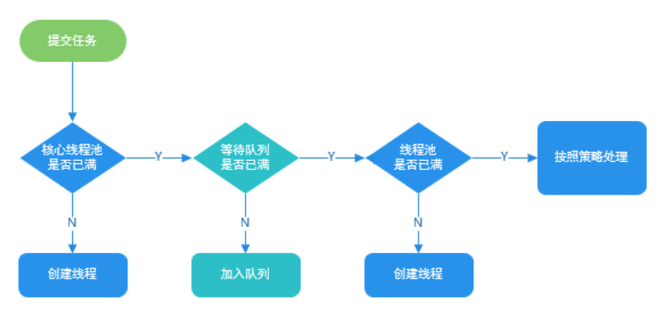
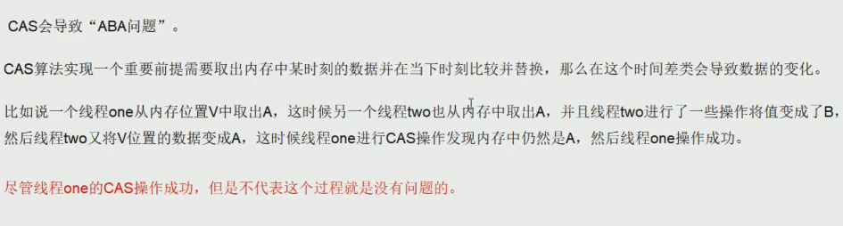
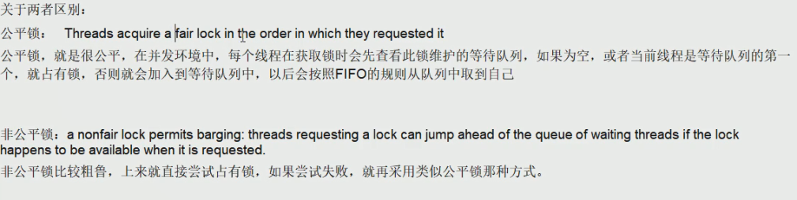
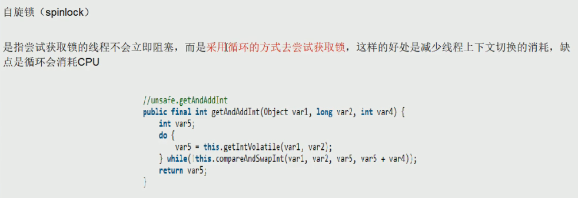
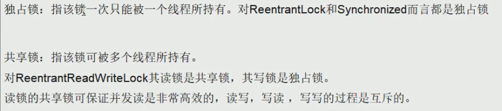
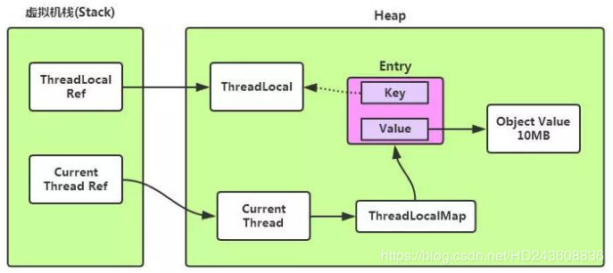
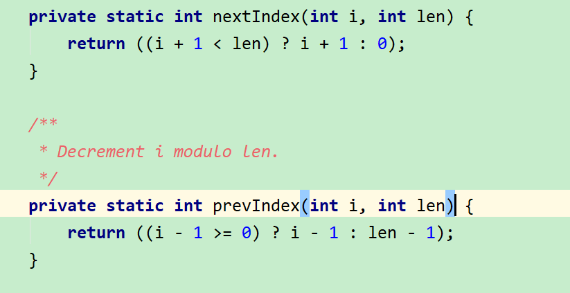
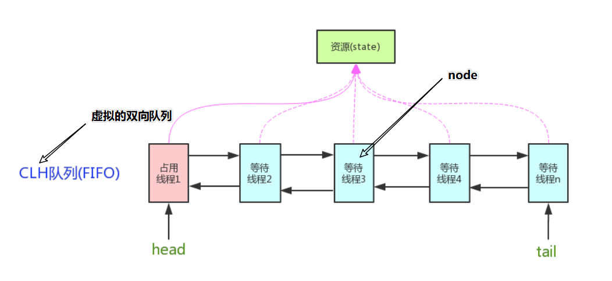

# 1、JUC是什么

java.util.concurrent在并发编程中使用的工具类

## 1.1 进程/线程是什么

**进程**：进程是一个具有一定独立功能的程序关于某个数据集合的一次运行活动。它是操作系统动态执行的基本单元，在传统的操作系统中，进程既是基本的分配单元，也是基本的执行单元。

**线程**：通常在一个进程中可以包含若干个线程，当然一个进程中至少有一个线程，不然没有存在的意义。线程可以利用进程所拥有的资源，在引入线程的操作系统中，通常都是把进程作为分配资源的基本单位，而把线程作为独立运行和独立调度的基本单位，由于线程比进程更小，基本上不拥有系统资源，故对它的调度所付出的开销就会小得多，能更高效的提高系统多个程序间并发执行的程度。

# 2、Lock

## 2.1 synchronized

```java
package com.juc.concurrent;

class Ticket{ //资源类
    private int number = 30;

    public synchronized void saleTicket(){
        if(number>0){
            System.out.println(Thread.currentThread().getName()+"卖出第："+(number--)+"还剩下"+number);
        }
    }
}
/*
* 题目：三个售票员卖出30张票
* 多线程的企业级套路加模板
* 1 在高内聚低耦合的前提下，线程 操作(对外暴露的调用方法) 资源类
*
* */

public class SaleTicket {
    public static void main(String[] args) {
        Ticket ticket = new Ticket();
        //Thread(Runnable target, String name)

        new Thread(new Runnable() {
            @Override
            public void run() {
                for (int i = 0; i < 40; i++) {
                    ticket.saleTicket();
                }
            }
        },"A").start();

        new Thread(new Runnable() {
            @Override
            public void run() {
                for (int i = 0; i < 40; i++) {
                    ticket.saleTicket();
                }
            }
        },"B").start();

        new Thread(new Runnable() {
            @Override
            public void run() {
                for (int i = 0; i < 40; i++) {
                    ticket.saleTicket();
                }
            }
        },"C").start();
    }
}

```

## 2.2 Lock

```java
class X {
   private final ReentrantLock lock = new ReentrantLock();
   // ...
 
   public void m() {
     lock.lock();  // block until condition holds
     try {
       // ... method body
     } finally {
       lock.unlock()
     }
   }
 }
```

```java
package com.juc.concurrent;

import java.util.concurrent.locks.Lock;
import java.util.concurrent.locks.ReentrantLock;

class Ticket{ //资源类
    private int number = 30;
    private Lock lock = new ReentrantLock();
    public void saleTicket(){

        lock.lock();
        try {
            if(number>0){
                System.out.println(Thread.currentThread().getName()+"卖出第："+(number--)+"还剩下"+number);
            }
        } catch (Exception e) {
            e.printStackTrace();
        } finally {
            lock.unlock();
        }
    }
}
/*
* 题目：三个售票员卖出30张票
* 多线程的企业级套路加模板
* 1 在高内聚低耦合的前提下，线程 操作(对外暴露的调用方法) 资源类
*
* */

public class SaleTicket {
    public static void main(String[] args) {
        Ticket ticket = new Ticket();
        //Thread(Runnable target, String name)

        new Thread(new Runnable() {
            @Override
            public void run() {
                for (int i = 0; i < 40; i++) {
                    ticket.saleTicket();
                }
            }
        },"A").start();

        new Thread(new Runnable() {
            @Override
            public void run() {
                for (int i = 0; i < 40; i++) {
                    ticket.saleTicket();
                }
            }
        },"B").start();

        new Thread(new Runnable() {
            @Override
            public void run() {
                for (int i = 0; i < 40; i++) {
                    ticket.saleTicket();
                }
            }
        },"C").start();
    }
}

```

## 2.3 wait/sleep 的区别

**wait 放下手中的锁子去睡**

sleep 带着锁去睡 睡行了在锁还在手里面

## 2.4 .start()

线程进入就绪态  没有开始干活


# 3、lambda表达式

```java
@FunctionalInterface
interface Foo{
    int add(int x,int y);
    default int div(int x,int y){
        System.out.println("默认方法");
        return x/y;
    }
    default int chen(int x,int y){
        System.out.println("默认方法");
        return x*y;
    }
    static void div1(int x,int y){
        System.out.println("静态乘法");
    }
    static void chen1(int x, int y){
        System.out.println("静态乘法");
    }
}

public class LambdaExpressDemo {
    public static void main(String[] args) {
        Foo foo = (int x,int y)->{
            System.out.println("hello");
            return x+y;
        };
        int add = foo.add(10, 20);
        System.out.println(add);
        int div = foo.div(20, 10);
        System.out.println(div);
        int chen = foo.chen(10, 20);
        System.out.println(chen);
        Foo.chen1(10,20);
        Foo.div1(10,10);
    }
}

```

# 4、线程之间的通信

## 4.1 题目

现在两个线程，可以操作初始值为0的一个变量

实现一个线程对该变量加1 一个线程对该变量减一的操作

实现交替10 轮 变量的 初始值为0

```java
package com.juc.concurrent;

class AirConditioner{ //资源类
    private  int num = 0;

    public synchronized void increment() throws InterruptedException {
        //1 判断
        if(num!=0){
            this.wait();
        }
        //2 干活
        num++;
        System.out.println(Thread.currentThread().getName()+num);
        //3 通知
        this.notifyAll();
    }

    public synchronized void decrement() throws InterruptedException {
        //1 判断
        if(num ==0){
            this.wait();
        }
        //2 干活
        num--;
        System.out.println(Thread.currentThread().getName()+num);
        //3 通知
        this.notifyAll();
    }
}
/*
* 题目
* 现在两个线程，可以操作初始值为0的一个变量
* 实现一个线程对该变量加1 一个线程对该变量减一的操作
* 实现交替10 轮 变量的 初始值为0
* 1 高内聚低耦合 线程操作资源类
* 2 判断、 通知 、干活
* */
public class ThreadWaitNotifyDemo {
    public static void main(String[] args) {
        AirConditioner airConditioner = new AirConditioner();
        new Thread(()->{
            for (int i = 0; i < 10; i++) {
                try {
                    airConditioner.increment();
                } catch (InterruptedException e) {
                    e.printStackTrace();
                }
            }
        },"生产者").start();
        new Thread(()->{
            for (int i = 0; i < 10; i++) {
                try {
                    airConditioner.decrement();
                } catch (InterruptedException e) {
                    e.printStackTrace();
                }
            }
        },"消费者").start();
    }
}

```

## 4.2 修改题目

变为两个消费者两个生产者

### 问题：（也就是下机以后上机必须在从新安检）

多线程交互中 ，必须要防止多线程虚假唤醒，也记 （判断只用while 不用if ）

像在一个参数版本中，中断和虚假唤醒是可能的，并且该方法应该始终在循环中使用： 

```java
  synchronized (obj) {
         while (<condition does not hold>)
             obj.wait();
         ... // Perform action appropriate to condition
     } 
```

```java
package com.juc.concurrent;

class AirConditioner{ //资源类
    private  int num = 0;

    public synchronized void increment() throws InterruptedException {
        //1 判断
        while(num!=0){
            this.wait();
        }
        //2 干活
        num++;
        System.out.println(Thread.currentThread().getName()+num);
        //3 通知
        this.notifyAll();
    }

    public synchronized void decrement() throws InterruptedException {
        //1 判断
        while(num ==0){
            this.wait();
        }
        //2 干活
        num--;
        System.out.println(Thread.currentThread().getName()+num);
        //3 通知
        this.notifyAll();
    }
}
/*
* 题目
* 现在两个线程，可以操作初始值为0的一个变量
* 实现一个线程对该变量加1 一个线程对该变量减一的操作
* 实现交替10 轮 变量的 初始值为0
* 
* 1 高内聚低耦合 线程操作资源类
* 2 判断、 通知 、干活
* 3 多线程交互中 ，必须要防止多线程虚假唤醒，也记 （判断只用while 不用if ）
* */
public class ThreadWaitNotifyDemo {
    public static void main(String[] args) {
        AirConditioner airConditioner = new AirConditioner();
        new Thread(()->{
            for (int i = 0; i < 10; i++) {
                try {
                    Thread.sleep(300);
                    airConditioner.increment();
                } catch (InterruptedException e) {
                    e.printStackTrace();
                }
            }
        },"生产者1:").start();
        new Thread(()->{
            for (int i = 0; i < 10; i++) {
                try {
                    Thread.sleep(300);
                    airConditioner.decrement();
                } catch (InterruptedException e) {
                    e.printStackTrace();
                }
            }
        },"消费者1:").start();
        new Thread(()->{
            for (int i = 0; i < 10; i++) {
                try {
                    Thread.sleep(400);
                    airConditioner.increment();
                } catch (InterruptedException e) {
                    e.printStackTrace();
                }
            }
        },"生产者2:").start();
        new Thread(()->{
            for (int i = 0; i < 10; i++) {
                try {
                    Thread.sleep(250);
                    airConditioner.decrement();
                } catch (InterruptedException e) {
                    e.printStackTrace();
                }
            }
        },"消费者2:").start();
    }
}

```

## 4.3 lock和condition实现

```java
package com.juc.concurrent;

import java.util.Locale;
import java.util.concurrent.locks.Condition;
import java.util.concurrent.locks.Lock;
import java.util.concurrent.locks.ReentrantLock;

class AirConditioner1{ //资源类

    private  int num = 0;
    private  Lock lock = new ReentrantLock();
    private Condition condition = lock.newCondition();

    public void increment() throws InterruptedException {
        lock.lock();
        try {
            //1 判断
            while(num!=0){
                condition.await();
            }
            //2 干活
            num++;
            System.out.println(Thread.currentThread().getName()+num);
            //3 通知
            condition.signalAll();
        } catch (Exception e) {
            e.printStackTrace();
        } finally {
            lock.unlock();
        }
    }

    public void decrement() throws InterruptedException {
        lock.lock();
        try {
            //1 判断
            while(num ==0){
                condition.await();
            }
            //2 干活
            num--;
            System.out.println(Thread.currentThread().getName()+num);
            //3 通知
            condition.signalAll();
        } catch (Exception e) {
            e.printStackTrace();
        } finally {
            lock.unlock();
        }
    }
}
/*
* 题目
* 现在两个线程，可以操作初始值为0的一个变量
* 实现一个线程对该变量加1 一个线程对该变量减一的操作
* 实现交替10 轮 变量的 初始值为0
*
* 1 高内聚低耦合 线程操作资源类
* 2 判断、 通知 、干活
* 3 多线程交互中 ，必须要防止多线程虚假唤醒，也记 （判断只用while 不用if ）
* */
public class ThreadWaitNotifyDemo1 {
    public static void main(String[] args) {
        AirConditioner airConditioner = new AirConditioner();
        new Thread(()->{
            for (int i = 0; i < 10; i++) {
                try {
                    Thread.sleep(300);
                    airConditioner.increment();
                } catch (InterruptedException e) {
                    e.printStackTrace();
                }
            }
        },"生产者1:").start();
        new Thread(()->{
            for (int i = 0; i < 10; i++) {
                try {
                    Thread.sleep(300);
                    airConditioner.decrement();
                } catch (InterruptedException e) {
                    e.printStackTrace();
                }
            }
        },"消费者1:").start();
        new Thread(()->{
            for (int i = 0; i < 10; i++) {
                try {
                    Thread.sleep(400);
                    airConditioner.increment();
                } catch (InterruptedException e) {
                    e.printStackTrace();
                }
            }
        },"生产者2:").start();
        new Thread(()->{
            for (int i = 0; i < 10; i++) {
                try {
                    Thread.sleep(250);
                    airConditioner.decrement();
                } catch (InterruptedException e) {
                    e.printStackTrace();
                }
            }
        },"消费者2:").start();
    }
}

```

## 4.4 面试题

两个线程，一个线程打印1-52，另一个打印字母A-Z打印顺序为12A34B...5152Z,
要求用线程间通信

### 4.4.1、synchronized 和 wait（） 和 notify（）

```java
package com.juc.concurrent;

class TestResource2{
    private int tag =1 ;
    private int num =1 ;
    private char aChar = 'A';

    public synchronized void printNumber() throws InterruptedException {

        while (tag !=1){
            this.wait();
        }
        System.out.print(num++);
        System.out.print(num++);
        tag=0;
        this.notify();
    }

    public  synchronized void printLetter() throws InterruptedException {
        while (tag==1){
            this.wait();
        }
        System.out.print(aChar);
        aChar = (char) (aChar+1);
        tag=1;
        this.notify();
    }
}


public class ThreadWaitNotifyTest2 {
    public static void main(String[] args) {
        TestResource2 testResource2 = new TestResource2();
        new Thread(()->{
            for (int i = 0; i < 26; i++) {
                try {
                    testResource2.printNumber();
                } catch (InterruptedException e) {
                    e.printStackTrace();
                }
            }
        },"").start();
        new Thread(()->{
            for (int i = 0; i < 26; i++) {
                try {
                    testResource2.printLetter();
                } catch (InterruptedException e) {
                    e.printStackTrace();
                }
            }
        },"").start();
    }
}

```


### 4.4.1、lock 和condition实现

```java
package com.juc.concurrent;


import java.util.concurrent.locks.Condition;
import java.util.concurrent.locks.Lock;
import java.util.concurrent.locks.ReentrantLock;

class TestResource{
    private int tag = 1;
    private int num = 1;
    private char a = 'A';
    private Lock lock = new ReentrantLock();
    private Condition condition = lock.newCondition();

    public void printNumber(){
        lock.lock();
        try {
            while (tag != 1){
                condition.await();
            }
            System.out.print(num++);
            System.out.print(num++);
            tag=0;
            condition.signal();
        } catch (Exception e) {
            e.printStackTrace();
        } finally {
            lock.unlock();
        }
    }


    public void printLetter(){
        lock.lock();
        try {
            while (tag == 1){
                condition.await();
            }
            System.out.print(a);
            tag=1;
            a= (char) (a+1);
            condition.signal();
        } catch (Exception e) {
            e.printStackTrace();
        } finally {
            lock.unlock();
        }
    }

}
/*
* 两个线程，一个线程打印1-52，另一个打印字母A-Z打印顺序为12A34B...5152Z,
*要求用线程间通信
*/
public class ThreadWaitNotifyTest1 {

    public static void main(String[] args) {

        TestResource testResource = new TestResource();

        new Thread(()->{
            for (int i = 0; i < 26; i++) {
                testResource.printNumber();
            }
        },"").start();
        new Thread(()->{
            for (int i = 0; i < 26; i++) {
                testResource.printLetter();
            }
        },"").start();

    }
}

```


# 5、线程间定制化调用通信

## 5.1 题目

多线程之间的调用顺序 实现A->B->c  A答应5次 B打印10次 c打印15次  循环15次

```java
package com.juc.concurrent;

import java.util.concurrent.locks.Condition;
import java.util.concurrent.locks.Lock;
import java.util.concurrent.locks.ReentrantLock;

class ShareResource{
    private int num = 1 ; //1:A 2:B 3:C
    private Lock lock = new ReentrantLock();
    private Condition c1 = lock.newCondition();
    private Condition c2 = lock.newCondition();
    private Condition c3 = lock.newCondition();


    public void print5(){
        lock.lock();
        try {
            //判断
            while (num!=1){
                c1.await();
            }
            //干活
            for (int i = 0; i < 5; i++) {
                System.out.println(Thread.currentThread().getName()+i);
            }
            //通知
            num = 2;
            c2.signal();
        } catch (Exception e) {
            e.printStackTrace();
        } finally {
            lock.unlock();
        }
    }

    public void print10(){
        lock.lock();
        try {
            //判断
            while (num!=2){
                c2.await();
            }
            //干活
            for (int i = 0; i < 10; i++) {
                System.out.println(Thread.currentThread().getName()+i);
            }
            //通知
            num = 3;
            c3.signal();
        } catch (Exception e) {
            e.printStackTrace();
        } finally {
            lock.unlock();
        }
    }

    public void print15(){
        lock.lock();
        try {
            //判断
            while (num!=3){
                c3.await();
            }
            //干活
            for (int i = 0; i < 15; i++) {
                System.out.println(Thread.currentThread().getName()+i);
            }
            //通知
            num = 1;
            c1.signal();
        } catch (Exception e) {
            e.printStackTrace();
        } finally {
            lock.unlock();
        }
    }
}


/*
* 多线程之间的调用顺序 实现A->B->c
* A答应5次 B打印10次 c打印15次
* 循环15次
* 1 高内聚低耦合 线程操作资源类
* 2 判断、 通知 、干活
* 3 多线程交互中 ，必须要防止多线程虚假唤醒，也记 （判断只用while 不用if ）
* 4 标志位
* */
public class ThreadOrderAccess {
    public static void main(String[] args) {
        ShareResource shareResource = new ShareResource();

        new Thread(()->{
            for (int i = 0; i < 10; i++) {
                shareResource.print5();
            }
        },"A: ").start();
        new Thread(()->{
            for (int i = 0; i < 10; i++) {
                shareResource.print10();
            }
        },"B: ").start();
        new Thread(()->{
            for (int i = 0; i < 10; i++) {
                shareResource.print15();
            }
        },"C: ").start();
    }
}

```

## 5.2 方法总结

1.  高内聚低耦合 线程   操作   资源类
2. 判断、 通知 、干活
3. 多线程交互中 ，必须要防止多线程虚假唤醒，也记 （判断只用while 不用if ）
4. 标志位


# 6、多线程锁


## 6.1  锁的8个问题


1 标准访问，先打印短信还是邮件
2 停4秒在短信方法内，先打印短信还是邮件
3 普通的hello方法，是先打短信还是hello
4 现在有两部手机，先打印短信还是邮件
5 两个静态同步方法，1部手机，先打印短信还是邮件
6 两个静态同步方法，2部手机，先打印短信还是邮件
7 1个静态同步方法，1个普通同步方法，1部手机，先打印短信还是邮件
8 1个静态同步方法，1个普通同步方法，2部手机，先打印短信还是邮件


## 6.2 锁的分析


A 一个对象里面如果有多个synchronized方法，某一个时刻内，只要一个线程去调用其中的一个synchronized方法了，其它的线程都只能等待，换句话说，某一个时刻内，只能有唯一一个线程去访问这些synchronized方法
锁的是当前对象this，被锁定后，其它的线程都不能进入到当前对象的其它的synchronized方法

加个普通方法后发现和同步锁无关
换成两个对象后，不是同一把锁了，情况立刻变化。


synchronized实现同步的基础：Java中的每一个对象都可以作为锁。
具体表现为以下3种形式。
对于普通同步方法，锁是当前实例对象。
对于静态同步方法，锁是当前类的Class对象。
对于同步方法块，锁是Synchonized括号里配置的对象

当一个线程试图访问同步代码块时，它首先必须得到锁，退出或抛出异常时必须释放锁。

也就是说如果一个实例对象的非静态同步方法获取锁后，该实例对象的其他非静态同步方法必须等待获取锁的方法释放锁后才能获取锁，
可是别的实例对象的非静态同步方法因为跟该实例对象的非静态同步方法用的是不同的锁，
所以毋须等待该实例对象已获取锁的非静态同步方法释放锁就可以获取他们自己的锁。

所有的**静态同步方法**用的也是同一把锁——**类对象本身**，
这两把锁是两个不同的对象，所以静态同步方法与非静态同步方法之间是不会有竞态条件的。
但是一旦一个静态同步方法获取锁后，其他的静态同步方法都必须等待该方法释放锁后才能获取锁，
而不管是同一个实例对象的静态同步方法之间，
还是不同的实例对象的静态同步方法之间，只要它们同一个类的实例对象！


## 6.3 代码

```java
package com.juc.concurrent;

import java.util.concurrent.TimeUnit;

class Phone{
    public static synchronized void sendEmail() {
        try {
            TimeUnit.SECONDS.sleep(4);
            System.out.println("send email");
        } catch (Exception e) {
            e.printStackTrace();
        }
    }
    public synchronized void sendEms(){
        System.out.println("send sms");
    }
    public void hello(){
        System.out.println("hello");
    }
}

/*
* 多线程8锁
* 1 标准访问 先打印邮件还是先打印短信 /?  邮件
* 2 邮件方法暂停4秒   请问是先答应邮件还是短信？ 邮件
* 3 新增一个方法hello() 请问先打印邮件还是hello ? hello
* 4 两部手机， 先打印邮件还是短信？ 短信
* 5 1部手机，两个静态同步方法 先打印邮件还是短信？ 邮件
* 6 2部手机，两个静态同步方法 先打印邮件男还是短信？ 邮件
* 7 一部手机 一个静态同步方法 一个普通同步方法，请问打印短信（静态）还是邮件 短信
* 8 2部手机 一个静态同步方法 一个普通同步方法，请问打印短信（静态）还是邮件 短信
* */

public class Lock8 {
    public static void main(String[] args) {
        Phone phone = new Phone();
        Phone phone2 = new Phone();
        new Thread(()->{
           phone.sendEmail();
        },"A").start();
        new Thread(()->{
           phone2.sendEms();
        },"B").start();
    }
}

```

 

# 7、List / Set /Map 线程不安全


## 7.1 举例

```java
List<String> list = new ArrayList<>();
for (int i = 0; i <30 ; i++) {
            new Thread(()->{
                list.add(UUID.randomUUID().toString().substring(0,8));
                System.out.println(list);
            },String.valueOf(i)).start();
        }
 
看ArrayList的源码
public boolean add(E e) {
    ensureCapacityInternal(size + 1);  // Increments modCount!!
    elementData[size++] = e;
    return true;
}
没有synchronized线程不安全
```


## 7.2 解决方案

- Vector()   
- Collections.synchronizedList(new ArrayList<>())
- 写时复制
  - CopyOnWriteArrayList
  - CopyOnWriteArraySet
  - ConcurrentHashMap

### 7.2.1 写时复制原理分析


```java
public boolean add(E e) {
    final ReentrantLock lock = this.lock;
    lock.lock();
    try {
        Object[] elements = getArray();
        int len = elements.length;
        Object[] newElements = Arrays.copyOf(elements, len + 1);
        newElements[len] = e;
        setArray(newElements);
        return true;
    } finally {
        lock.unlock();
    }
}
```


CopyOnWrite容器即写时复制的容器。往一个容器添加元素的时候，不直接往当前容器Object[]添加，
而是先将当前容器Object[]进行Copy，复制出一个新的容器Object[] newElements，然后向新的容器Object[] newElements里添加元素。
添加元素后，再将原容器的引用指向新的容器setArray(newElements)。
这样做的好处是可以对CopyOnWrite容器进行并发的读，而不需要加锁，因为当前容器不会添加任何元素。
所以CopyOnWrite容器也是一种读写分离的思想，读和写不同的容器。

 

## 7.3 代码

```java
package com.juc.concurrent;

import java.util.*;
import java.util.concurrent.ConcurrentHashMap;
import java.util.concurrent.CopyOnWriteArrayList;
import java.util.concurrent.CopyOnWriteArraySet;

/*
* 题目：请举例集合是不安全的
* 1. 故障现象
* java.util.ConcurrentModificationException
*
* 2 导致原因
*
*
* 3 解决方案
*   3.1 Vector()
*   3.2 Collections.synchronizedList(new ArrayList<>())
*   3.3 new CopyOnWriteArrayList<>();
*
* 4 优化建议
*
*
* */
public class NotSafeDemo1 {
    public static void main(String[] args) {
        //构造一个空的 HashMap ，默认初始容量（16）和默认负载系数（0.75）
        Map<String,String> map = new ConcurrentHashMap<>();//Collections.synchronizedMap(new HashMap<>());//new HashMap<>();
        for (int i = 0; i < 30; i++) {
            new Thread(() -> {
                map.put(Thread.currentThread().getName(),UUID.randomUUID().toString().substring(0,8));
                System.out.println(map);
            }, String.valueOf(i)).start();
        }
    }

    private static void SetNotSafe() {
        /*
        * hashset()底层是hashmap() add 方法调用的是 haspmap.put()方法
        * */
        Set<String> set = new CopyOnWriteArraySet<>();//Collections.synchronizedSet();//new HashSet<>();
        for (int i = 0; i < 30; i++) {
            new Thread(()->{
                set.add(UUID.randomUUID().toString().substring(0,8));
                System.out.println(set);
            },String.valueOf(i)).start();
        }
    }

    private static void ListNotSafe() {
        List<String> list = new CopyOnWriteArrayList<>(); //Collections.synchronizedList(new ArrayList<>()); //new Vector<>();
        for (int i = 0; i < 30; i++) {
            new Thread(()->{
               list.add(UUID.randomUUID().toString().substring(0,8));
                System.out.println(list);
            },String.valueOf(i)).start();
        }
    }

}


```


# 8 、callable接口

## 8.1 获得多线程的方法有几种


 1、继承Thread类实现多线程 

 2、实现Runnable接口方式实现多线程 

 3、使用 Callable、Future实现有返回结果的多线程 

## 8.2 FutureTask

未来的任务，用它就干一件事，异步调用
main方法就像一个冰糖葫芦，一个个方法由main串起来。
但解决不了一个问题：正常调用挂起堵塞问题

例子：
（1）老师上着课，口渴了，去买水不合适，讲课线程继续，我可以单起个线程找班长帮忙买水，
水买回来了放桌上，我需要的时候再去get。
（2）4个同学，A算1+20,B算21+30,C算31*到40,D算41+50，是不是C的计算量有点大啊，
FutureTask单起个线程给C计算，我先汇总ABD，最后等C计算完了再汇总C，拿到最终结果
（3）高考：会做的先做，不会的放在后面做

### 8.2.1 原理

在主线程中需要执行比较耗时的操作时，但又不想阻塞主线程时，可以把这些作业交给Future对象在后台完成，
当主线程将来需要时，就可以通过Future对象获得后台作业的计算结果或者执行状态。一般FutureTask多用于耗时的计算，主线程可以在完成自己的任务后，再去获取结果。

仅在计算完成时才能检索结果；如果计算尚未完成，则阻塞 get 方法。一旦计算完成，就不能再重新开始或取消计算。get方法而获取结果只有在计算完成时获取，否则会一直阻塞直到任务转入完成状态，然后会返回结果或者抛出异常。 

**只计算一次**
get方法放到最后

## 8.3 代码

```java
package com.juc.concurrent;


import java.util.concurrent.Callable;
import java.util.concurrent.ExecutionException;
import java.util.concurrent.FutureTask;
import java.util.concurrent.TimeUnit;

class MyThread1 implements Runnable{
    @Override
    public void run() {

    }
}

class MyThread2 implements Callable<String>{

    @Override
    public String call() throws Exception {
        System.out.println("here ");
        TimeUnit.SECONDS.sleep(4);
        return "1024";
    }
}
/*
*  callable 接口和 Runnable接口的区别
*  1. 是否有返回值
*  2. 是否抛异常
*  3. 落地方法不一样 一个是call 一个是run
* */

/*
* 多线程中第3种获得多线程的方式
* 1 . get()方法一般放在最后一行
*
* */
public class CallableDemo {
    public static void main(String[] args) throws ExecutionException, InterruptedException {
        FutureTask futureTask = new FutureTask(new MyThread2());
        new Thread(futureTask,"A").start();
        new Thread(futureTask,"B").start();
        
        System.out.println(Thread.currentThread().getName()+"...计算完成");
        System.out.println(futureTask.get());

    }
}

```


# 10、ReentrantReadWriteLock读写锁

## 10.1 例子


```java
package com.juc.concurrent;

import java.util.HashMap;
import java.util.Map;
import java.util.concurrent.TimeUnit;
import java.util.concurrent.locks.ReadWriteLock;
import java.util.concurrent.locks.ReentrantReadWriteLock;

class MyCache{

    private volatile Map<String,Object> map = new HashMap<>();
    private ReadWriteLock readWriteLock = new ReentrantReadWriteLock();

    public void put (String k,String v){
        readWriteLock.writeLock().lock();
        try {
            System.out.println(Thread.currentThread().getName()+"\t 写入数据"+k);
            try {
                TimeUnit.MICROSECONDS.sleep(300);
            } catch (InterruptedException e) {
                e.printStackTrace();
            }
            map.put(k,v);
            System.out.println(Thread.currentThread().getName()+"\t 写入完成");
        } catch (Exception e) {
            e.printStackTrace();
        } finally {
            readWriteLock.writeLock().unlock();
        }
    }

    public void get (String k){
        readWriteLock.readLock().lock();
        try {
            System.out.println(Thread.currentThread().getName()+"\t 读取数据");
            try {
                TimeUnit.MICROSECONDS.sleep(300);
            } catch (InterruptedException e) {
                e.printStackTrace();
            }
            Object o = map.get(k);
            System.out.println(Thread.currentThread().getName()+"\t 读取完成"+o);
        } catch (Exception e) {
            e.printStackTrace();
        } finally {
            readWriteLock.readLock().unlock();
        }

    }
}


/*
* 多线程同时读一个资源类没有任何问题，所以为了满足并发量，读取共享资源应该同时进行
* 但是如果有一个资源想去写共享资源
* 就不应该有其他的线程可以对该资源进行读和写
* 小总结
*       读-读 可共存
*       读-写 不能共存
*       写-写 不能共存
*
* */
public class ReadWriteLockDemo {
    public static void main(String[] args) {
        MyCache myCache = new MyCache();
        for (int i = 1; i <= 5; i++) {
            int finalI = i;
            new Thread(()->{
               myCache.put(finalI+"",finalI+"");
            },String.valueOf(i)).start();
        }

        for (int i = 1; i <= 5; i++) {
            int finalI = i;
            new Thread(()->{
                myCache.get(finalI+"");
            },String.valueOf(i)).start();
        }
    }
}

```


# 11、BlockingQueue 阻塞队列


## 11.1 阻塞队列

阻塞：必须要阻塞/不得不阻塞 
阻塞队列是一个队列，在数据结构中起的作用如下图：


当队列是空的，从队列中获取元素的操作将会被阻塞
当队列是满的，从队列中添加元素的操作将会被阻塞

试图从空的队列中获取元素的线程将会被阻塞，直到其他线程往空的队列插入新的元素

试图向已满的队列中添加新元素的线程将会被阻塞，直到其他线程从队列中移除一个或多个元素或者完全清空，使队列变得空闲起来并后续新增


## 11.2 阻塞队列的用处

在多线程领域：所谓阻塞，在某些情况下会挂起线程（即阻塞），一旦条件满足，被挂起的线程又会自动被唤起

为什么需要BlockingQueue
好处是我们不需要关心什么时候需要阻塞线程，什么时候需要唤醒线程，因为这一切BlockingQueue都给你一手包办了

在concurrent包发布以前，在多线程环境下，我们每个程序员都必须去自己控制这些细节，尤其还要兼顾效率和线程安全，而这会给我们的程序带来不小的复杂度。


## 11.3 种类梳理、架构分析


- **ArrayBlockingQueue：由数组结构组成的有界阻塞队列。**

- **LinkedBlockingQueue：由链表结构组成的有界（但大小默认值为integer.MAX_VALUE）阻塞队列**

- PriorityBlockingQueue：支持优先级排序的无界阻塞队列。

- DelayQueue：使用优先级队列实现的延迟无界阻塞队列。

- **SynchronousQueue：不存储元素的阻塞队列，也即单个元素的队列。**

- LinkedTransferQueue：由链表组成的无界阻塞队列。

- LinkedBlocking**Deque**：由链表组成的双向阻塞队列。

  

## 11.4 BlockingQueue的核心方法


| 抛出异常 | 当阻塞队列满时，再往队列里add插入元素会抛IllegalStateException:Queue full<br/>当阻塞队列空时，再往队列里remove移除元素会抛NoSuchElementException |
| -------- | :----------------------------------------------------------- |
| 特殊值   | 插入方法，成功ture失败false<br/>移除方法，成功返回出队列的元素，队列里没有就返回null |
| 一直阻塞 | 当阻塞队列满时，生产者线程继续往队列里put元素，队列会一直阻塞生产者线程直到put数据or响应中断退出<br/>当阻塞队列空时，消费者线程试图从队列里take元素，队列会一直阻塞消费者线程直到队列可用 |
| 超时退出 | 当阻塞队列满时，队列会阻塞生产者线程一定时间，超过限时后生产者线程会退出 |


## 11.5 代码

```java
package com.juc.concurrent;

import jdk.nashorn.internal.objects.annotations.Getter;

import java.util.concurrent.ArrayBlockingQueue;
import java.util.concurrent.BlockingQueue;
import java.util.concurrent.TimeUnit;


public class BlockingQueueDemo {
    public static void main(String[] args) throws InterruptedException {
        BlockingQueue<String> blockingQueue = new ArrayBlockingQueue<>(3);
        // 抛异常
        /*System.out.println(blockingQueue.add("a"));
        System.out.println(blockingQueue.add("b"));
        System.out.println(blockingQueue.add("c"));
//        System.out.println(blockingQueue.add("x"));
        System.out.println(blockingQueue.remove());
        System.out.println(blockingQueue.remove());
        System.out.println(blockingQueue.remove());
        System.out.println(blockingQueue.remove());*/

        /*System.out.println(blockingQueue.offer("a"));
        System.out.println(blockingQueue.offer("b"));
        System.out.println(blockingQueue.offer("c"));
//        System.out.println(blockingQueue.offer("x")); false
        System.out.println(blockingQueue.poll());
        System.out.println(blockingQueue.poll());
        System.out.println(blockingQueue.poll());
//        System.out.println(blockingQueue.poll());  null */

        /*blockingQueue.put("a");
        blockingQueue.put("b");
        blockingQueue.put("c");
//        blockingQueue.put("x");
        System.out.println(blockingQueue.take());
        System.out.println(blockingQueue.take());
        System.out.println(blockingQueue.take());
        System.out.println(blockingQueue.take());*/

        System.out.println(blockingQueue.offer("a"));
        System.out.println(blockingQueue.offer("a"));
        System.out.println(blockingQueue.offer("a"));
        System.out.println(blockingQueue.offer("a",3L, TimeUnit.SECONDS));


    }
}

```


# 12、ThreadPool线程池

## 12.1 为什么需要多线程

>  **池化技术相比大家已经屡见不鲜了，线程池、数据库连接池、Http 连接池等等都是对这个思想的应用。池化技术的思想主要是为了减少每次获取资源的消耗，提高对资源的利用率。** 

 

- **降低资源消耗**。通过重复利用已创建的线程降低线程创建和销毁造成的消耗。
- **提高响应速度**。当任务到达时，任务可以不需要的等到线程创建就能立即执行。
- **提高线程的可管理性**。线程是稀缺资源，如果无限制的创建，不仅会消耗系统资源，还会降低系统的稳定性，使用线程池可以进行统一的分配，调优和监控。

## 12.2 线程池怎么使用

### 12.2.1 线程池架构


 

###  12.2.2  实现线程池的几种方法

> Executors 返回线程池对象的弊端如下：
>
> - **`FixedThreadPool` 和 `SingleThreadExecutor`** ： 允许请求的队列长度为 Integer.MAX_VALUE,可能堆积大量的请求，从而导致 OOM。
> - **`CachedThreadPool` 和 `ScheduledThreadPool`** ： 允许创建的线程数量为 Integer.MAX_VALUE ，可能会创建大量线程，从而导致 OOM。

#### Executors.newFixedThreadPool(int)

  

执行长期任务性能好，创建一个线程池，一池有N个固定的线程，有固定线程数的线程

```java
public static ExecutorService newFixedThreadPool(int nThreads) {
    return new ThreadPoolExecutor(nThreads, nThreads,
                                  0L, TimeUnit.MILLISECONDS,
                                  new LinkedBlockingQueue<Runnable>());
}
 
newFixedThreadPool创建的线程池corePoolSize和maximumPoolSize值是相等的，它使用的是LinkedBlockingQueue
```


#### Executors.newSingleThreadExecutor()


一个任务一个任务的执行，一池一线程

```java
public static ExecutorService newSingleThreadExecutor() {
    return new FinalizableDelegatedExecutorService
        (new ThreadPoolExecutor(1, 1,
                                0L, TimeUnit.MILLISECONDS,
                                new LinkedBlockingQueue<Runnable>()));
}
 
newSingleThreadExecutor 创建的线程池corePoolSize和maximumPoolSize值都是1，它使用的是LinkedBlockingQueue
 
```


#### Executors.newCachedThreadPool()


执行很多短期异步任务，线程池根据需要创建新线程，但在先前构建的线程可用时将重用它们。可扩容，遇强则强

```java
public static ExecutorService newCachedThreadPool() {
    return new ThreadPoolExecutor(0, Integer.MAX_VALUE,
                                  60L, TimeUnit.SECONDS,
                                  new SynchronousQueue<Runnable>());
}
newCachedThreadPool创建的线程池将corePoolSize设置为0，将maximumPoolSize设置为Integer.MAX_VALUE，它使用的是SynchronousQueue，也就是说来了任务就创建线程运行，当线程空闲超过60秒，就销毁线程。
```


#### 代码

```java
package com.juc.concurrent;

import java.util.concurrent.*;

public class MyThreadPoolDemo {
    public static void main(String[] args) {
        newCachedThreadPool();
    }

    private static void newCachedThreadPool() {
        ExecutorService threadPool = Executors.newCachedThreadPool();
        try {
            for (int i = 1; i <= 10; i++) {
                threadPool.execute(()->{
                    try { TimeUnit.MILLISECONDS.sleep(20); } catch (InterruptedException e) { e.printStackTrace(); }
                    System.out.println(Thread.currentThread().getName() + "\t 办理业务 ");
                });
            }
        } catch (Exception e) {
            e.printStackTrace();
        } finally {
            threadPool.shutdown();
        }
        /* 执行结果
        * pool-1-thread-1	 办理业务 
            pool-1-thread-9	 办理业务 
            pool-1-thread-8	 办理业务 
            pool-1-thread-5	 办理业务 
            pool-1-thread-3	 办理业务 
            pool-1-thread-7	 办理业务 
            pool-1-thread-2	 办理业务 
            pool-1-thread-6	 办理业务 
            pool-1-thread-4	 办理业务 
            pool-1-thread-1办理业务 
        * */
    }

    private static void newSingleThreadExectorTest() {
        ExecutorService threadPool = Executors.newSingleThreadExecutor(); //一池单线程
        try {
            for (int i = 0; i < 10; i++) {
                threadPool.execute(() -> {
                    System.out.println(Thread.currentThread().getName() + "\t 办理业务");
                });
            }
        } catch (Exception e) {
            e.printStackTrace();
        } finally {
            threadPool.shutdown();
        }
        /*执行结果
        * pool-1-thread-1	 办理业务
        pool-1-thread-1	 办理业务
        pool-1-thread-1	 办理业务
        pool-1-thread-1	 办理业务
        pool-1-thread-1	 办理业务
        pool-1-thread-1	 办理业务
        pool-1-thread-1	 办理业务
        pool-1-thread-1	 办理业务
        pool-1-thread-1	 办理业务
        pool-1-thread-1	 办理业务
        * */
    }

    private static void newFixedThreadPoolTest() {
        ExecutorService threadPool = Executors.newFixedThreadPool(5); //一池5个受理线程 ，类似一个银行5和受理窗口
        try {
            for (int i = 1; i <= 10; i++) {
                try {
                    TimeUnit.MILLISECONDS.sleep(10);
                } catch (InterruptedException e) {
                    e.printStackTrace();
                }
                threadPool.execute(() -> {
                    System.out.println(Thread.currentThread().getName() + "\t 办理业务");

                });
            }
        } catch (Exception e) {
            e.printStackTrace();
        } finally {
            threadPool.shutdown();
        }
        /* 执行结果
        *   pool-1-thread-1	 办理业务
            pool-1-thread-2	 办理业务
            pool-1-thread-3	 办理业务
            pool-1-thread-4	 办理业务
            pool-1-thread-5	 办理业务
            pool-1-thread-1	 办理业务
            pool-1-thread-2	 办理业务
            pool-1-thread-3	 办理业务
            pool-1-thread-4	 办理业务
            pool-1-thread-5	 办理业务
        * */
    }


}

```


### 12.2.3 ThreadPoolExecutor底层原理





## 12.3 线程池的几个重要参数


```java
 public ThreadPoolExecutor(int corePoolSize,//线程池的核心线程数量
                              int maximumPoolSize,//线程池的最大线程数
                              long keepAliveTime,//当线程数大于核心线程数时，多余的空闲线程存活的最长时间
                              TimeUnit unit,//时间单位
                              BlockingQueue<Runnable> workQueue,//任务队列，用来储存等待执行任务的队列
                              ThreadFactory threadFactory,//线程工厂，用来创建线程，一般默认即可
                              RejectedExecutionHandler handler//拒绝策略，当提交的任务过多而不能及时处理时，我们可以定制策略来处理任务
                               ) {
        if (corePoolSize < 0 ||
            maximumPoolSize <= 0 ||
            maximumPoolSize < corePoolSize ||
            keepAliveTime < 0)
            throw new IllegalArgumentException();
        if (workQueue == null || threadFactory == null || handler == null)
            throw new NullPointerException();
        this.corePoolSize = corePoolSize;
        this.maximumPoolSize = maximumPoolSize;
        this.workQueue = workQueue;
        this.keepAliveTime = unit.toNanos(keepAliveTime);
        this.threadFactory = threadFactory;
        this.handler = handler;
    }
```

**`ThreadPoolExecutor` 3 个最重要的参数：**

- **`corePoolSize` :** 核心线程数线程数定义了最小可以同时运行的线程数量。
- **`maximumPoolSize` :** 当队列中存放的任务达到队列容量的时候，当前可以同时运行的线程数量变为最大线程数。
- **`workQueue`:** 当新任务来的时候会先判断当前运行的线程数量是否达到核心线程数，如果达到的话，信任就会被存放在队列中。

`ThreadPoolExecutor`其他常见参数:

1. **`keepAliveTime`**:当线程池中的线程数量大于 `corePoolSize` 的时候，如果这时没有新的任务提交，核心线程外的线程不会立即销毁，而是会等待，直到等待的时间超过了 `keepAliveTime`才会被回收销毁；
2. **`unit`** : `keepAliveTime` 参数的时间单位。
3. **`threadFactory`** :executor 创建新线程的时候会用到。
4. **`handler`** :饱和策略。关于饱和策略下面单独介绍一下。


## 12.4  线程池底层的工作原理


1、在创建了线程池后，开始等待请求。

2、当调用execute()方法添加一个请求任务时，线程池会做出如下判断：
  2.1如果正在运行的线程数量小于corePoolSize，那么马上创建线程运行这个任务；
  2.2如果正在运行的线程数量大于或等于corePoolSize，那么将这个任务**放入队列**；
  2.3如果这个时候队列满了且正在运行的线程数量还小于maximumPoolSize，那么还是要创建非核心线程立刻运行这个任务；
  2.4如果队列满了且正在运行的线程数量大于或等于maximumPoolSize，那么线程池会**启动饱和拒绝策略来执行**。
3、当一个线程完成任务时，它会从队列中取下一个任务来执行。
4、当一个线程无事可做超过一定的时间（keepAliveTime）时，线程会判断：
    如果当前运行的线程数大于corePoolSize，那么这个线程就被停掉。
    所以线程池的所有任务完成后，**它最终会收缩到corePoolSize的大小**。


## 12.5 线程池用哪个？生产中如设置合理参数

**线程池数量**

- **CPU 密集型任务(N+1)：** 这种任务消耗的主要是 CPU 资源，可以将线程数设置为 N（CPU 核心数）+1，比 CPU 核心数多出来的一个线程是为了防止线程偶发的缺页中断，或者其它原因导致的任务暂停而带来的影响。一旦任务暂停，CPU 就会处于空闲状态，而在这种情况下多出来的一个线程就可以充分利用 CPU 的空闲时间。
- **I/O 密集型任务(2N)：** 这种任务应用起来，系统会用大部分的时间来处理 I/O 交互，而线程在处理 I/O 的时间段内不会占用 CPU 来处理，这时就可以将 CPU 交出给其它线程使用。因此在 I/O 密集型任务的应用中，我们可以多配置一些线程，具体的计算方法是 2N。


### 12.5.1 线程池的拒绝策略


 等待队列已经排满了，再也塞不下新任务了 同时，

线程池中的max线程也达到了，无法继续为新任务服务。

这个是时候我们就需要拒绝策略机制合理的处理这个问题。


####  jdk内置拒绝策略

**AbortPolicy**(默认)：直接抛出RejectedExecutionException异常阻止系统正常运行

**CallerRunsPolicy**：“调用者运行”一种调节机制，该策略既不会抛弃任务，也不会抛出异常，而是将某些任务回退到调用者，从而降低新任务的流量。

**DiscardOldestPolicy**：抛弃队列中等待最久的任务，然后把当前任务加人队列中尝试再次提交当前任务。

**DiscardPolicy**：该策略默默地丢弃无法处理的任务，不予任何处理也不抛出异常。如果允许任务丢失，**这是最好的一种策略。**


以上内置拒绝策略均实现了RejectedExecutionHandle接口


### 12.5.2  在工作中单一的/固定数的/可变的三种创建线程池的方法哪个用的多？超级大坑

**是一个都不用，我们工作中只能使用自定义的**


### 12.5.3 自定义线程池（四种拒绝策略对比）


```java
package com.juc.concurrent;

import java.util.concurrent.*;

public class MyThreadPoolDemo2 {
    public static void main(String[] args) {
        DiscardPolicyTest();
    }

    private static void DiscardPolicyTest() {
        ExecutorService threadPool = new ThreadPoolExecutor(
                2,
                5,
                2,
                TimeUnit.SECONDS,
                new LinkedBlockingQueue<>(3),
                Executors.defaultThreadFactory(),
                new ThreadPoolExecutor.DiscardPolicy());
        try {
            for (int i = 0; i < 10; i++) {
                threadPool.execute(()->{
                    System.out.println(Thread.currentThread().getName() + "\t 办理业务");
                });
            }
        } catch (Exception e) {
            e.printStackTrace();
        } finally {
            threadPool.shutdown();
        }

        // 拒绝策略 new ThreadPoolExecutor.DiscardPolicy()
        /* 执行了8 个业务
        *pool-1-thread-1	 办理业务
        pool-1-thread-3	 办理业务
        pool-1-thread-2	 办理业务
        pool-1-thread-1	 办理业务
        pool-1-thread-5	 办理业务
        pool-1-thread-2	 办理业务
        pool-1-thread-3	 办理业务
        pool-1-thread-4	 办理业务

        * */
    }

    private static void DiscardOldestPolicyTest() {
        ExecutorService threadPool = new ThreadPoolExecutor(
                2,
                5,
                2,
                TimeUnit.SECONDS,
                new LinkedBlockingQueue<>(3),
                Executors.defaultThreadFactory(),
                new ThreadPoolExecutor.DiscardOldestPolicy());
        try {
            for (int i = 0; i < 10; i++) {
                threadPool.execute(()->{
                    System.out.println(Thread.currentThread().getName() + "\t 办理业务");
                });
            }
        } catch (Exception e) {
            e.printStackTrace();
        } finally {
            threadPool.shutdown();
        }

        // 拒绝策略 new ThreadPoolExecutor.DiscardOldestPolicy()
        /* 执行了9个业务
        *pool-1-thread-1	 办理业务
        pool-1-thread-3	 办理业务
        pool-1-thread-2	 办理业务
        pool-1-thread-4	 办理业务
        pool-1-thread-2	 办理业务
        pool-1-thread-1	 办理业务
        pool-1-thread-5	 办理业务
        pool-1-thread-4	 办理业务
        pool-1-thread-3	 办理业务

        * */
    }

    private static void CallerRunsPolicyTest() {
        ExecutorService threadPool = new ThreadPoolExecutor(
                2,
                5,
                2,
                TimeUnit.SECONDS,
                new LinkedBlockingQueue<>(3),
                Executors.defaultThreadFactory(),
                new ThreadPoolExecutor.CallerRunsPolicy());
        try {
            for (int i = 0; i < 10; i++) {
                threadPool.execute(()->{
                    System.out.println(Thread.currentThread().getName() + "\t 办理业务");
                });
            }
        } catch (Exception e) {
            e.printStackTrace();
        } finally {
            threadPool.shutdown();
        }

        // 拒绝策略 new ThreadPoolExecutor.CallerRunsPolicy() 将任务抛给调用者
        /* 执行了10 个业务
        *pool-1-thread-1	 办理业务
        main	 办理业务
        pool-1-thread-4	 办理业务
        pool-1-thread-3	 办理业务
        pool-1-thread-2	 办理业务
        pool-1-thread-3	 办理业务
        pool-1-thread-5	 办理业务
        pool-1-thread-4	 办理业务
        pool-1-thread-1	 办理业务
        main	 办理业务

        * */
    }

    private static void AbortPolicyTest() {
        ExecutorService threadPool = new ThreadPoolExecutor(
                2,
                5,
                2,
                TimeUnit.SECONDS,
                new LinkedBlockingQueue<>(3),
                Executors.defaultThreadFactory(),
                new ThreadPoolExecutor.AbortPolicy());
        try {
            for (int i = 0; i < 10; i++) {
                threadPool.execute(()->{
                    System.out.println(Thread.currentThread().getName() + "\t 办理业务");
                });
            }
        } catch (Exception e) {
            e.printStackTrace();
        } finally {
            threadPool.shutdown();
        }

        // 拒绝策略 new ThreadPoolExecutor.AbortPolicy()
        /* 执行了8 个业务  抛出异常
        * pool-1-thread-1	 办理业务
        java.util.concurrent.RejectedExecutionException: Task com.juc.concurrent.MyThreadPoolDemo2$$Lambda$1/1078694789@3b9a45b3 rejected from java.util.concurrent.ThreadPoolExecutor@7699a589[Running, pool size = 5, active threads = 0, queued tasks = 0, completed tasks = 8]
        pool-1-thread-3	 办理业务
            at java.util.concurrent.ThreadPoolExecutor$AbortPolicy.rejectedExecution(ThreadPoolExecutor.java:2047)
        pool-1-thread-2	 办理业务
            at java.util.concurrent.ThreadPoolExecutor.reject(ThreadPoolExecutor.java:823)
        pool-1-thread-5	 办理业务
            at java.util.concurrent.ThreadPoolExecutor.execute(ThreadPoolExecutor.java:1369)
        pool-1-thread-3	 办理业务
            at com.juc.concurrent.MyThreadPoolDemo2.main(MyThreadPoolDemo2.java:18)
        pool-1-thread-4	 办理业务
        pool-1-thread-1	 办理业务
        pool-1-thread-2	 办理业务
        * */
    }
}

```


# 13、Java8之流式计算复习


## 13.1、函数式接口


### 13.1.1 java 内置的四大函数式接口


### 13.1.2 代码演示


```java
package com.yang.sh.juc;

import java.util.function.Consumer;
import java.util.function.Function;
import java.util.function.Predicate;
import java.util.function.Supplier;

public class FunctionDemo {
    public static void main(String[] args) {
        System.out.println("Function --------------------------------------");

        Function<String,Integer> function1 = new Function<String, Integer>() {
            @Override
            public Integer apply(String s) {
                return s.length();
            }
        };
        System.out.println(function1.apply("abc"));
        Function<String ,Integer> function2 = s->{return s.length();};
        System.out.println(function2.apply("dhasdja"));

        System.out.println("Predicate --------------------------------------");

        Predicate<String> predicate1 = new Predicate<String>() {
            @Override
            public boolean test(String s) {
                return s.length()>2;
            }
        };
        System.out.println(predicate1.test("adas"));
        Predicate<String> predicate2 = s ->{return s.length()<2;};
        System.out.println(predicate2.test("asas"));

        System.out.println("Consumer --------------------------------------");

        Consumer<String> consumer1 = new Consumer<String>() {
            @Override
            public void accept(String s) {
                System.out.println(s);
            }
        };
        consumer1.accept("asasasas");
        Consumer<String> consumer2 = s->{System.out.println(s);};
        consumer2.accept("我来试试");

        System.out.println("Supplier --------------------------------------");

        Supplier<String> supplier1 = new Supplier<String>() {
            @Override
            public String get() {
                return "sadasd";
            }
        };
        System.out.println(supplier1.get());
        Supplier<Boolean> supplier2 = ()->{return true;};
        System.out.println(supplier2.get());

    }
}

```


## 13.2 、Stream流


### 13.2.1  流(Stream) 到底是什么呢？


**是数据渠道，**用于操作数据源（集合、数组等）所生成的元素序列。
“**集合讲的是数据，流讲的是计算**！”


### 13.2.2 特点

- Stream 自己不会存储元素
- Stream 不会改变源对象。相反，他们会返回一个持有结果的新Stream。
- Stream 操作是延迟执行的。这意味着他们会等到需要结果的时候才执行。


### 13.2.3 代码


 

```java
package com.yang.sh.juc;

import lombok.AllArgsConstructor;
import lombok.Data;
import lombok.NoArgsConstructor;

import java.util.Arrays;
import java.util.Comparator;
import java.util.List;
import java.util.function.Function;
import java.util.logging.Filter;

@Data
@NoArgsConstructor
@AllArgsConstructor
class User{
    private Integer id  ;
    private String userName;
    private int age;

}
/*
* 偶数ID
* 年龄大于24
* 且用户名转为大写
* 且用户字母倒排序
* 只输出一个用户名字
* */
public class StreamDemo {
    public static void main(String[] args) {
        User u1 = new User(11, "a", 23);
        User u2 = new User(12, "b", 24);
        User u3 = new User(13, "c", 22);
        User u4 = new User(14, "d", 28);
        User u5 = new User(16, "e", 26);

        List<User> list = Arrays.asList(u1, u2, u3, u4, u5);

        list.stream()
                .filter(u->u.getId()%2==0)
                .filter(u->u.getAge()>24)
                .map(u->u.getUserName().toUpperCase())
                .sorted((o1,o2)-> o2.compareTo(o1))
                .limit(1)
                .forEach(System.out::println);


    }
}

```


# 14、分支合并框架


## 14.1 原理


**Fork：把一个复杂任务进行分拆，大事化小**
**Join：把分拆任务的结果进行合并**


## 14.2 相关类


### ForkJoinPool


分支合并池    类比=>   线程池


### ForkJoinTask


ForkJoinTask    类比=>   FutureTask


### RecursiveTask


递归任务：继承后可以实现递归(自己调自己)调用的任务

```java
 class Fibonacci extends RecursiveTask<Integer> {
   final int n;
   Fibonacci(int n) { this.n = n; }
   Integer compute() {
     if (n <= 1)
       return n;
     Fibonacci f1 = new Fibonacci(n - 1);
     f1.fork();
     Fibonacci f2 = new Fibonacci(n - 2);
     return f2.compute() + f1.join();
   }

```


## 14.3 实例代码

```java
package com.yang.sh.juc;

import java.util.concurrent.ExecutionException;
import java.util.concurrent.ForkJoinPool;
import java.util.concurrent.ForkJoinTask;
import java.util.concurrent.RecursiveTask;

class MyTask extends RecursiveTask<Integer>{

    public static final Integer ADJUST_VALUE =10;

    private int begin ;
    private int end;
    private int result;

    public MyTask(int begin, int end) {
        this.begin = begin;
        this.end = end;
    }

    @Override
    protected Integer compute() {
        if((end-begin)<ADJUST_VALUE){
            for (int i = begin; i <= end; i++) {
                result = result+i;
            }
        }else{
            int middle = (begin + end) / 2;
            MyTask myTask01 = new MyTask(begin, middle);
            MyTask myTask02 = new MyTask(middle+1, end);
            myTask01.fork();
            myTask02.fork();
            result = myTask01.join()+myTask02.join();
        }
        return result;
    }
}
/*
* 计算从1 加到 100
* */
public class ForkJoinDemo {
    public static void main(String[] args) throws ExecutionException, InterruptedException {
        MyTask myTask = new MyTask(0, 100);
        ForkJoinPool forkJoinPool = new ForkJoinPool();
        ForkJoinTask<Integer> joinTask = forkJoinPool.submit(myTask);
        Integer i = joinTask.get();
        System.out.println(i);
        forkJoinPool.shutdown();
    }
}

```


# 15 异步回调


## 15.1 代码

```java
package com.yang.sh.juc;

import java.util.concurrent.CompletableFuture;
import java.util.concurrent.ExecutionException;


public class CompletableFutureDemo {
    public static void main(String[] args) throws ExecutionException, InterruptedException {
        CompletableFuture<Void> completableFuture = CompletableFuture.runAsync(() -> {
            System.out.println(Thread.currentThread().getName() + "没有返回 update mysql OK");
        });
        System.out.println(completableFuture.get());  //没有返回值 null
        //ForkJoinPool.commonPool-worker-1没有返回 update mysql OK
        //null
        CompletableFuture<Integer> completableFuture1 = CompletableFuture.supplyAsync(() -> {
            System.out.println(Thread.currentThread().getName() + "有返回 update mysql OK");
            int age = 10/0;
            return 1024;
        });
        
        Integer i = completableFuture1.whenComplete((t, u) -> {
            System.out.println("*********t:" + t);
            System.out.println("*********u:" + u);
        }).exceptionally(f -> {
            System.out.println("*******Excepution:" + f.getMessage());
            return 444;
        }).get();
        System.out.println(i);
        /*
        * 正常执行
        *   ForkJoinPool.commonPool-worker-1没有返回 update mysql OK
            null
            ForkJoinPool.commonPool-worker-1有返回 update mysql OK
            *********t:1024
            *********u:null
            1024
        * */
        /*
        * 异常
        *   ForkJoinPool.commonPool-worker-1没有返回 update mysql OK
            null
            ForkJoinPool.commonPool-worker-1有返回 update mysql OK
            *********t:null
            *********u:java.util.concurrent.CompletionException: java.lang.ArithmeticException: / by zero
            *******Excepution:java.lang.ArithmeticException: / by zero
            444
        * */
    }
}

```


# 16 . CAS

## 16. 1 什么是CAS

简单来说就是---比较当前工作内存的值和主内存的值，如果相同则执行规定操作，否则继续比较直到主内存和工作内存的值一致为止

> 主要使用的方法 compareAndSet(int expect, int update)

比较并交换  compareAndSet

底层实现 unsafe+ 自旋锁

> atomicInteger.getAndIncrement()


## 16.2 unSafe


unsafe是CAS的核心类 ,由于Java 方法无法直接访问底层 ,需要通过本地(native)方法来访问，**注意UnSafe类中所有的方法都是native修饰的,也就是说UnSafe类中的方法都是直接调用操作底层资源执行响应的任务**，基于该类可以直接操作特额定的内存数据.UnSafe类在于**sun.misc**包中,其内部方法操作可以向C的指针一样直接操作内存,因为Java中CAS操作的助兴依赖于UNSafe类的方法.

>  变量ValueOffset,便是该变量在内存中的偏移地址,因为UnSafe就是根据内存偏移地址获取数据的

> 变量value和volatile修饰,保证了多线程之间的可见性.

## 16.3 使用atomicInteger.getAndIncrement()举例


- 使用当前对象的值和var5比较
- 如果相同，更新var5 的值并且返回
- 如果不同，继续取值然后进行比较，直到更新完成


## 16.4 CAS的缺点

- 循环时间长开销大
- 只能保证一个共享变量的原子性
- 产生ABA的问题

# 17. ABA问题

## 17.1 什么是ABA问题



## 17.2 原子引用

AtomicInteger 只能操作一个数字

AutmicReference 就可以是对象拥有原子性


## 17.3 解决ABA问题AtomicStampedReference

> AtomicStampedReference给每个要操作的对象加上版本号

比较引用的同时也要比较版本号

> 先比较手中的引用值是否相等，如果想等，在版本号是否相等，如果不相等，则修改失败，进行下一次修改

> atomicStampedReference.compareAndSet（期望值，修改值，期望版本号，修改版本号）

`ABA问题解决举例`

```java

public class AutomicReference_01 {
    private static AtomicReference<Integer> atomicReference=new AtomicReference<>(100);
    private static AtomicStampedReference<Integer> stampedReference=new AtomicStampedReference<>(100,1);

    public static void main(String[] args) {
        System.out.println("===以下是ABA问题的产生===");
        new Thread(()->{
            atomicReference.compareAndSet(100,101);
            atomicReference.compareAndSet(101,100);
        },"t1").start();

        new Thread(()->{
            //先暂停1秒 保证完成ABA
            try { TimeUnit.SECONDS.sleep(1); } catch (InterruptedException e) { e.printStackTrace(); }
            System.out.println(atomicReference.compareAndSet(100, 2019)+"\t"+atomicReference.get());
        },"t2").start();
        try { TimeUnit.SECONDS.sleep(2); } catch (InterruptedException e) { e.printStackTrace(); }
        System.out.println("===以下是ABA问题的解决===");

        new Thread(()->{
            int stamp = stampedReference.getStamp();
            System.out.println(Thread.currentThread().getName()+"\t 第1次版本号"+stamp+"\t值是"+stampedReference.getReference());
            //暂停1秒钟t3线程
            try { TimeUnit.SECONDS.sleep(1); } catch (InterruptedException e) { e.printStackTrace(); }

            stampedReference.compareAndSet(100,101,stampedReference.getStamp(),stampedReference.getStamp()+1);
            System.out.println(Thread.currentThread().getName()+"\t 第2次版本号"+stampedReference.getStamp()+"\t值是"+stampedReference.getReference());
            stampedReference.compareAndSet(101,100,stampedReference.getStamp(),stampedReference.getStamp()+1);
            System.out.println(Thread.currentThread().getName()+"\t 第3次版本号"+stampedReference.getStamp()+"\t值是"+stampedReference.getReference());
        },"t3").start();

        new Thread(()->{
            int stamp = stampedReference.getStamp();
            System.out.println(Thread.currentThread().getName()+"\t 第1次版本号"+stamp+"\t值是"+stampedReference.getReference());
            //保证线程3完成1次ABA
            try { TimeUnit.SECONDS.sleep(3); } catch (InterruptedException e) { e.printStackTrace(); }
            boolean result = stampedReference.compareAndSet(100, 2019, stamp, stamp + 1);
            System.out.println(Thread.currentThread().getName()+"\t 修改成功否"+result+"\t最新版本号"+stampedReference.getStamp());
            System.out.println("最新的值\t"+stampedReference.getReference());
        },"t4").start();

    }
}
```


# 18 、锁

## 18.1 公平锁和非公平锁

- 公平锁
      是指多个线程按照申请锁的顺序来获取锁类似排队打饭 先来后到

- 非公平锁
      是指在多线程获取锁的顺序并不是按照申请锁的顺序,有可能后申请的线程比先申请的线程优先获取到锁,在高并发的情况下,有可能造成优先级反转或者饥饿现象

> 并发包ReentrantLock的创建可以指定构造函数的boolean类型来得到公平锁或者非公平锁 默认是非公平锁



> Java ReentrantLock而言,
> 通过构造哈数指定该锁是否是公平锁 默认是非公平锁 非公平锁的优点在于吞吐量必公平锁大.
>
>
> 对于synchronized而言 也是一种非公平锁

## 18.2 可重入锁（递归锁）

> 线程在外层方法获取锁之后，在内层方法会自动获得锁


> ReentrantLock/synchronized就是一个典型的可重入锁

> - 最大的作用就是可以避免死锁

代码演示

```java
package com.sh.juc.lock;

class Phone{
    public synchronized void sendEmail(){
        System.out.println(Thread.currentThread().getId()+"\t send email");
        sendSms();
    }
    public synchronized void sendSms(){
        System.out.println(Thread.currentThread().getId()+"\t send sms");
    }
}

public class RecursionLock_synchronized {
    public static void main(String[] args) {
        Phone phone = new Phone();
        new Thread(()->{
           phone.sendEmail();
        },"A").start();
        new Thread(()->{
            phone.sendEmail();
        },"B").start();
    }
    //12	 send email
    //12	 send sms
    //13	 send email
    //13	 send sms
}

```

```java
package com.sh.juc.lock;

import java.util.concurrent.locks.Lock;
import java.util.concurrent.locks.ReentrantLock;

class DPhone{
    private Lock lock = new ReentrantLock();
    public  void sendEmail(){
        lock.lock();
        try {
            System.out.println(Thread.currentThread().getId()+"\t send email");
            sendSms();
        } finally {
            lock.unlock();
        }
    }
    public void sendSms(){
        lock.lock();
        try {
            System.out.println(Thread.currentThread().getId()+"\t send sms");
        } finally {
            lock.unlock();
        }
    }
}
public class RecursionLock_ReetrantLock {
    public static void main(String[] args) {
        DPhone dPhone = new DPhone();
        new Thread(()->{
            dPhone.sendEmail();
        },"A").start();
        new Thread(()->{
            dPhone.sendEmail();
        },"B").start();
        //12	 send email
        //12	 send sms
        //13	 send email
        //13	 send sms
    }
}

```

## 18.3 自旋锁




> 自旋锁实现

```java
package com.sh.juc.lock;


import java.util.concurrent.TimeUnit;
import java.util.concurrent.atomic.AtomicReference;

public class SpinLock {


    private AtomicReference<Thread>  atomicReference = new AtomicReference<>();

    public void myLock(){
        Thread thread = Thread.currentThread();
        System.out.println(Thread.currentThread().getName()+"\t 进来了");
        while (!atomicReference.compareAndSet(null,thread)){

        }
        System.out.println(Thread.currentThread().getName()+"\t 获得了");
    }
    public void unMyLock(){
        Thread thread = Thread.currentThread();
        atomicReference.compareAndSet(thread,null);
        System.out.println(Thread.currentThread().getName()+"\t 出来了");

    }

    public static void main(String[] args) {
        SpinLock spinLock = new SpinLock();
        new Thread(()->{
           spinLock.myLock();
           try { TimeUnit.MILLISECONDS.sleep(5000); } catch (InterruptedException e) { e.printStackTrace(); }
           spinLock.unMyLock();
        },"A").start();
        try { TimeUnit.MILLISECONDS.sleep(1000); } catch (InterruptedException e) { e.printStackTrace(); }
        new Thread(()->{
            spinLock.myLock();
            try { TimeUnit.MILLISECONDS.sleep(1000); } catch (InterruptedException e) { e.printStackTrace(); }
            spinLock.unMyLock();
        },"B").start();
    }
}
//A	 进来了
//A	 获得了
//B	 进来了
//A	 出来了
//B	 获得了
//B	 出来了
```


## 18.4 共享锁/独占锁 




> 使用ReentrantReadWriteLock 写一个缓存

```java
package com.sh.juc.lock;

import java.util.HashMap;
import java.util.Map;
import java.util.concurrent.TimeUnit;
import java.util.concurrent.locks.ReentrantReadWriteLock;

public class myCache {
    //保证可见性
    private volatile Map<String,Object> map = new HashMap<>();
    private ReentrantReadWriteLock readWriteLock = new ReentrantReadWriteLock();

    public void write(String key,Object value){
        readWriteLock.writeLock().lock();
        try {
            System.out.println(Thread.currentThread().getName()+"\t 正在写入"+key);
            try { TimeUnit.MILLISECONDS.sleep(300); } catch (InterruptedException e) { e.printStackTrace(); }
            map.put(key,value);
            System.out.println(Thread.currentThread().getName()+"\t 写入完成");
        } finally {
            readWriteLock.writeLock().unlock();
        }
    }

    public void read(String key){
        readWriteLock.readLock().lock();
        try {
            System.out.println(Thread.currentThread().getName()+"\t 正在读取");
            try { TimeUnit.MILLISECONDS.sleep(300); } catch (InterruptedException e) { e.printStackTrace(); }
            Object re = map.get(key);
            System.out.println(Thread.currentThread().getName()+"\t 读取完成"+re);
        } finally {
            readWriteLock.readLock().unlock();
        }
    }

    public void clearCache(){
        map.clear();
    }

    public static void main(String[] args) {
        myCache myCache = new myCache();
        for (int i = 1; i <= 5; i++) {
            int finalI = i;
            new Thread(()->{
               myCache.write(finalI+"",finalI);
            },String.valueOf(i)).start();
        }
        for (int i = 1; i <= 5; i++) {
            int finalI = i;
            new Thread(()->{
                myCache.read(finalI+"");
            },String.valueOf(i)).start();
        }
    }
}

```


## 18.5 悲观锁&乐观锁

悲观锁

> 总是假设最坏的情况，每次去拿数据的时候都认为别人会修改，所以每次在拿数据的时候都会上锁，这样别人想拿这个数据就会阻塞直到它拿到锁（**共享资源每次只给一个线程使用，其它线程阻塞，用完后再把资源转让给其它线程**）。传统的关系型数据库里边就用到了很多这种锁机制，比如行锁，表锁等，读锁，写锁等，都是在做操作之前先上锁。Java中`synchronized`等独占锁就是悲观锁思想的实现。

乐观锁--(版本号机制和CAS算法实现）

> 总是假设最好的情况，每次去拿数据的时候都认为别人不会修改，所以不会上锁，但是在更新的时候会判断一下在此期间别人有没有去更新这个数据，可以使用版本号机制和CAS算法实现。**乐观锁适用于多读的应用类型，这样可以提高吞吐量**，像数据库提供的类似于**write_condition机制**，其实都是提供的乐观锁。在Java中`java.util.concurrent.atomic`包下面的原子变量类就是使用了乐观锁的一种实现方式**CAS**实现的。
>
> java中的类AtomicStampedReference 实用类版本号+CAS 

两种锁的适用场景

乐观锁多适用于读多些少的情况下

悲观锁多使用于写多的情况下


# 19、ThreadLocal

## 19.1 ThreadLocal是什么

>  ThreadLocal 是一个本地线程副本变量工具类 ，为共享变量在每个线程中创建一个副本，每个线程可以访问自己内部的副本变量 ， 各个线程之间的变量互不干扰，在高并发场景下，可以实现无状态的调用，适用于各个线程不共享变量值的操作。 

## 19.2 .ThreadLocal 工作原理是什么？

每个线程的内部都维护了一个 ThreadLocalMap，它是一个 Map（key,value）数据格式，key 是一个弱引用，也就是 ThreadLocal 本身，而 value 存的是线程变量的值。

也就是说 ThreadLocal 本身并不存储线程的变量值，它只是一个工具，用来维护线程内部的 Map，帮助存和取变量。



##  19.3 ThreadLocal 如何解决 Hash 冲突？ 

 与 HashMap 不同，ThreadLocalMap 结构非常简单，没有 next 引用，也就是说 ThreadLocalMap 中解决 Hash 冲突的方式并非链表的方式，而是采用**线性探测**的方式。所谓线性探测，就是根据初始 key 的 hashcode 值确定元素在 table 数组中的位置，如果发现这个位置上已经被其他的 key 值占用，则利用固定的算法寻找一定步长的下个位置，依次判断，直至找到能够存放的位置。 



## 19.4**为什么 ThreadLocalMap 的 key 是弱引用？**

我们知道 ThreadLocalMap 中的 key 是弱引用，而 value 是强引用才会导致内存泄露的问题，至于为什么要这样设计，这样分为两种情况来讨论：

- key 使用强引用：这样会导致一个问题，引用的 ThreadLocal 的对象被回收了，但是 ThreadLocalMap 还持有 ThreadLocal 的强引用，如果没有手动删除，ThreadLocal 不会被回收，则会导致内存泄漏。
- key 使用弱引用：这样的话，引用的 ThreadLocal 的对象被回收了，由于 ThreadLocalMap 持有 ThreadLocal 的弱引用，即使没有手动删除，ThreadLocal 也会被回收。value 在下一次 ThreadLocalMap 调用 set、get、remove 的时候会被清除。

比较以上两种情况，我们可以发现：由于 ThreadLocalMap 的生命周期跟 Thread 一样长，如果都没有手动删除对应 key，都会导致内存泄漏，但是使用弱引用可以多一层保障，弱引用 ThreadLocal 不会内存泄漏，对应的 value 在下一次 ThreadLocalMap 调用 set、get、remove 的时候被清除，算是最优的解决方案。

## 19.5ThreadLocal 的内存泄露是怎么回事

ThreadLocal 在 ThreadLocalMap 中是以一个弱引用身份被 Entry 中的 Key 引用的，因此如果 ThreadLocal 没有外部强引用来引用它，那么 ThreadLocal 会在下次 JVM 垃圾收集时被回收。这个时候 Entry 中的 key 已经被回收，但是 value 又是一强引用不会被垃圾收集器回收，这样 ThreadLocal 的线程如果一直持续运行，value 就一直得不到回收，这样就会发生内存泄露。


# 20、AQS

## 20 .1 AQS核心思想

> **被请求的共享资源空闲，则将当前请求资源的线程设置为有效的工作线程，并且将共享资源设置为锁定状态 。**
>
> **如果请求的共享资源已经被占用，那么就需要一套线程阻塞等待以及被唤醒时锁分配的机制**
>
> **这个机制AQS采用CLH队列来实现的，即将暂时获取不到锁子的线程加入到队列中**



 AQS 使用一个 int 成员变量来表示同步状态，通过内置的 FIFO 队列来完成获取资源线程的排队工作。AQS 使用 CAS 对该同步状态进行原子操作实现对其值的修改 

## 20.2 AQS对资源的共享方式

### （1）独占

​	只有一个线程能执行，如 ReentrantLock。又可分为公平锁和非公平锁,ReentrantLock 同时支持两种锁,下面以 ReentrantLock 对这两种锁的定义做介绍：

- 公平锁：按照线程在队列中的排队顺序，先到者先拿到锁
- 非公平锁：当线程要获取锁时，先通过两次 CAS 操作去抢锁，如果没抢到，当前线程再加入到队列中等待唤醒。

> 两者不同点
>
> 1. 非公平锁在调用 lock 后，首先就会调用 CAS 进行一次抢锁，如果这个时候恰巧锁没有被占用，那么直接就获取到锁返回了。
> 2. 非公平锁在 CAS 失败后，和公平锁一样都会进入到 tryAcquire 方法，在 tryAcquire 方法中，如果发现锁这个时候被释放了（state == 0），非公平锁会直接 CAS 抢锁，但是公平锁会判断等待队列是否有线程处于等待状态，如果有则不去抢锁，乖乖排到后面。

### **2)Share**（共享）

多个线程可同时执行，如 Semaphore/CountDownLatch。Semaphore、CountDownLatCh、 CyclicBarrier、ReadWriteLock 我们都会在后面讲到。

ReentrantReadWriteLock 可以看成是组合式，因为 ReentrantReadWriteLock 也就是读写锁允许多个线程同时对某一资源进行读。

不同的自定义同步器争用共享资源的方式也不同。自定义同步器在实现时只需要实现共享资源 state 的获取与释放方式即可，至于具体线程等待队列的维护（如获取资源失败入队/唤醒出队等），AQS 已经在上层已经帮我们实现好了。

## 20.3 底层采用了模板方法模式

同步器的设计是基于模板方法模式的，如果需要自定义同步器一般的方式是这样（模板方法模式很经典的一个应用）：

1. 使用者继承 AbstractQueuedSynchronizer 并重写指定的方法。（这些重写方法很简单，无非是对于共享资源 state 的获取和释放）
2. 将 AQS 组合在自定义同步组件的实现中，并调用其模板方法，而这些模板方法会调用使用者重写的方法。

**AQS 使用了模板方法模式，自定义同步器时需要重写下面几个 AQS 提供的模板方法：**

```java
isHeldExclusively()//该线程是否正在独占资源。只有用到condition才需要去实现它。
tryAcquire(int)//独占方式。尝试获取资源，成功则返回true，失败则返回false。
tryRelease(int)//独占方式。尝试释放资源，成功则返回true，失败则返回false。
tryAcquireShared(int)//共享方式。尝试获取资源。负数表示失败；0表示成功，但没有剩余可用资源；正数表示成功，且有剩余资源。
tryReleaseShared(int)//共享方式。尝试释放资源，成功则返回true，失败则返回false。
```


> **可重入锁**
>
>  以 ReentrantLock 为例，state 初始化为 0，表示未锁定状态。A 线程 lock()时，会调用 tryAcquire()独占该锁并将 state+1。此后，其他线程再 tryAcquire()时就会失败，直到 A 线程 unlock()到 state=0（即释放锁）为止，其它线程才有机会获取该锁。当然，释放锁之前，A 线程自己是可以重复获取此锁的（state 会累加），这就是可重入的概念。但要注意，获取多少次就要释放多么次，这样才能保证 state 是能回到零态的。 

>  再以 CountDownLatch 以例，任务分为 N 个子线程去执行，state 也初始化为 N（注意 N 要与线程个数一致）。这 N 个子线程是并行执行的，每个子线程执行完后 countDown()一次，state 会 CAS(Compare and Swap)减 1。等到所有子线程都执行完后(即 state=0)，会 unpark()主调用线程，然后主调用线程就会从 await()函数返回，继续后余动作。 

## 20.4  CountDownLatch 减少次数


```java
package com.juc.concurrent;


import java.util.concurrent.CountDownLatch;

public class CountDownLatchDemo {
    public static void main(String[] args) throws InterruptedException {
        CountDownLatch countDownLatch = new CountDownLatch(6);
        for (int i = 0; i < 6; i++) {
            new Thread(()->{
                System.out.println(Thread.currentThread().getName()+"\t离开教室");
                countDownLatch.countDown();
            },String.valueOf(i)).start();
        }
        countDownLatch.await();
        System.out.println(Thread.currentThread().getName()+"\t班长关门走人");
    }
}
0	离开教室
3	离开教室
1	离开教室
2	离开教室
5	离开教室
4	离开教室
main	班长关门走人

```

###  1）原理

 * CountDownLatch主要有两个方法，当一个或多个线程调用await方法时，这些线程会阻塞。
 * 其它线程调用countDown方法会将计数器减1(调用countDown方法的线程不会阻塞)，
 * 当计数器的值变为0时，因await方法阻塞的线程会被唤醒，继续执行。

### 2）场景


## 20.5  CyclicBarrier 循环栏杆


```java
package com.juc.concurrent;

        import java.util.concurrent.BrokenBarrierException;
        import java.util.concurrent.CyclicBarrier;

public class CyclicBarrierDemo {
    public static void main(String[] args) {
        //CyclicBarrier(int parties, Runnable barrierAction)
        CyclicBarrier cyclicBarrier = new CyclicBarrier(7,()->{
            System.out.println("**召唤神龙");
        });
        for (int i = 1; i <= 7; i++) {
            int finalI = i;
            new Thread(()->{
                System.out.println(Thread.currentThread().getName()+"得到第"+ finalI +"颗龙珠");
                try {
                    cyclicBarrier.await();
                } catch (InterruptedException e) {
                    e.printStackTrace();
                } catch (BrokenBarrierException e) {
                    e.printStackTrace();
                }
            },String.valueOf(i)).start();
        }
    }
}
/*
1得到第1颗龙珠
5得到第5颗龙珠
6得到第6颗龙珠
4得到第4颗龙珠
3得到第3颗龙珠
2得到第2颗龙珠
7得到第7颗龙珠
**召唤神龙
* */

```


### 1)原理

* CyclicBarrier
 * 的字面意思是可循环（Cyclic）使用的屏障（Barrier）。它要做的事情是，
 * 让一组线程到达一个屏障（也可以叫同步点）时被阻塞，
 * 直到最后一个线程到达屏障时，屏障才会开门，所有
 * 被屏障拦截的线程才会继续干活。
 * 线程进入屏障通过CyclicBarrier的await()方法。

### 2) 使用场景

 CyclicBarrier 可以用于多线程计算数据，最后合并计算结果的应用场景。比如我们用一个 Excel 保存了用户所有银行流水，每个 Sheet 保存一个帐户近一年的每笔银行流水，现在需要统计用户的日均银行流水，先用多线程处理每个 sheet 里的银行流水，都执行完之后，得到每个 sheet 的日均银行流水，最后，再用 barrierAction 用这些线程的计算结果，计算出整个 Excel 的日均银行流水。 


## 20.6 Semaphore信号灯

```java
package com.juc.concurrent;


import java.util.concurrent.Semaphore;
import java.util.concurrent.TimeUnit;

public class SemaphoreDemo {
    public static void main(String[] args) {
        Semaphore semaphore = new Semaphore(3); // 模拟资源类有3个空车位

        for (int i = 0; i < 6; i++) {
            new Thread(()->{
                try {
                    semaphore.acquire();
                    System.out.println(Thread.currentThread().getName()+"\t抢到了车位");
                    TimeUnit.SECONDS.sleep(3);
                    System.out.println(Thread.currentThread().getName()+"\t离开了车位");
                } catch (InterruptedException e) {
                    e.printStackTrace();
                } finally {
                    semaphore.release();
                }
            },String.valueOf(i)).start();
        }
    }
}

```

**资源变为1 就类似于synchronize**

### 9.3.1 原理

 在信号量上我们定义两种操作：

 * acquire（获取） 当一个线程调用acquire操作时，它要么通过成功获取信号量（信号量减1），
 * 要么一直等下去，直到有线程释放信号量，或超时。
 * release（释放）实际上会将信号量的值加1，然后唤醒等待的线程。
 * 信号量主要用于两个目的，一个是用于多个共享资源的互斥使用，另一个用于并发线程数的控制。

